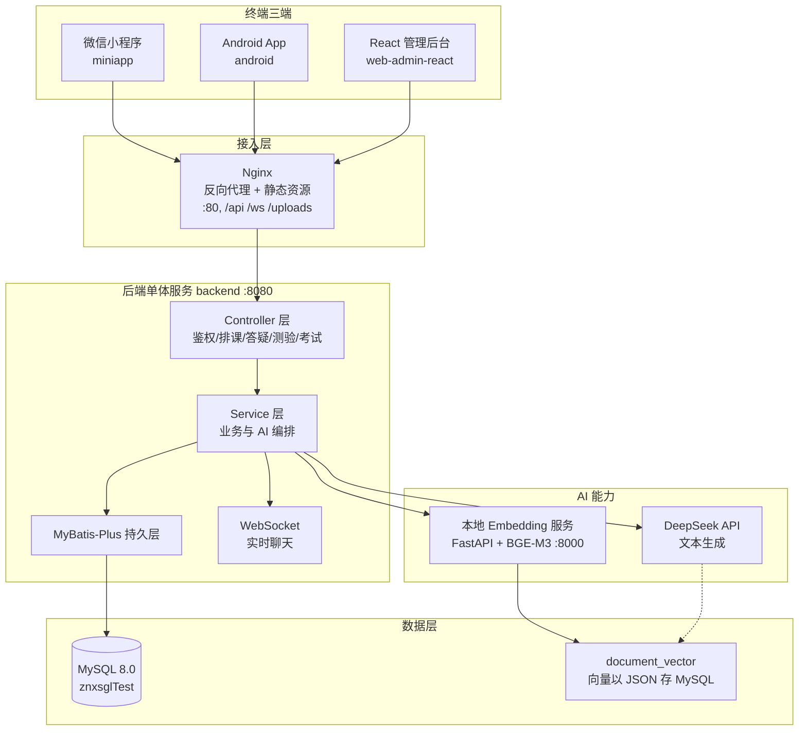
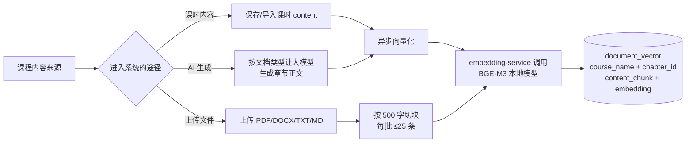
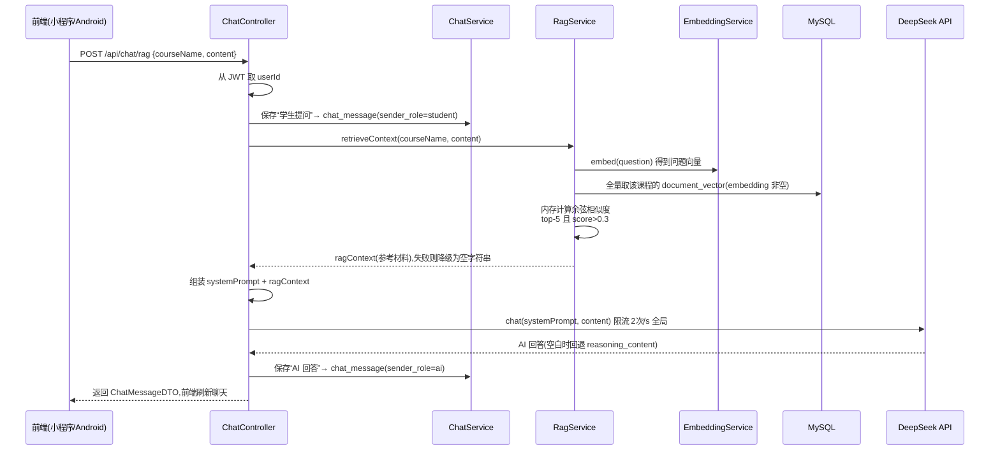
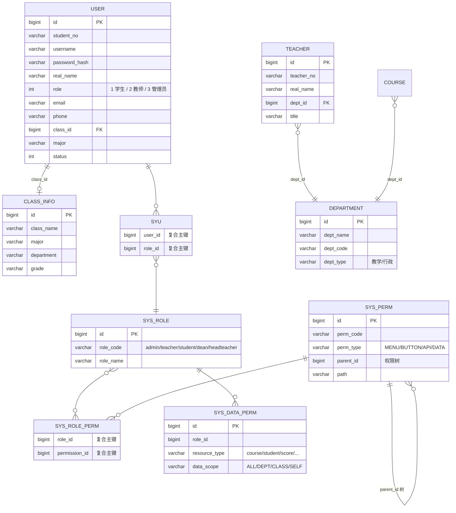
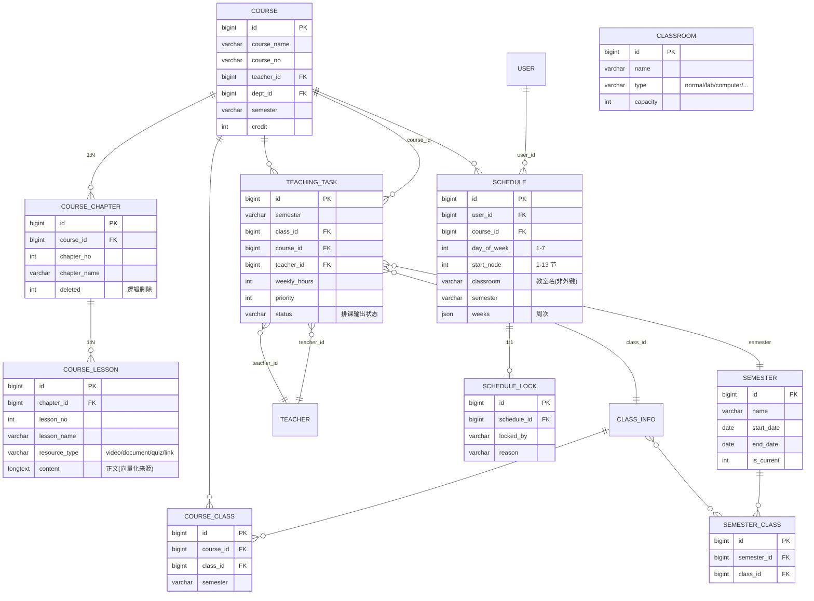
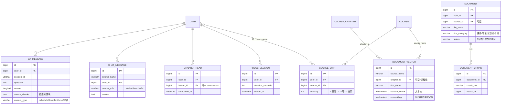
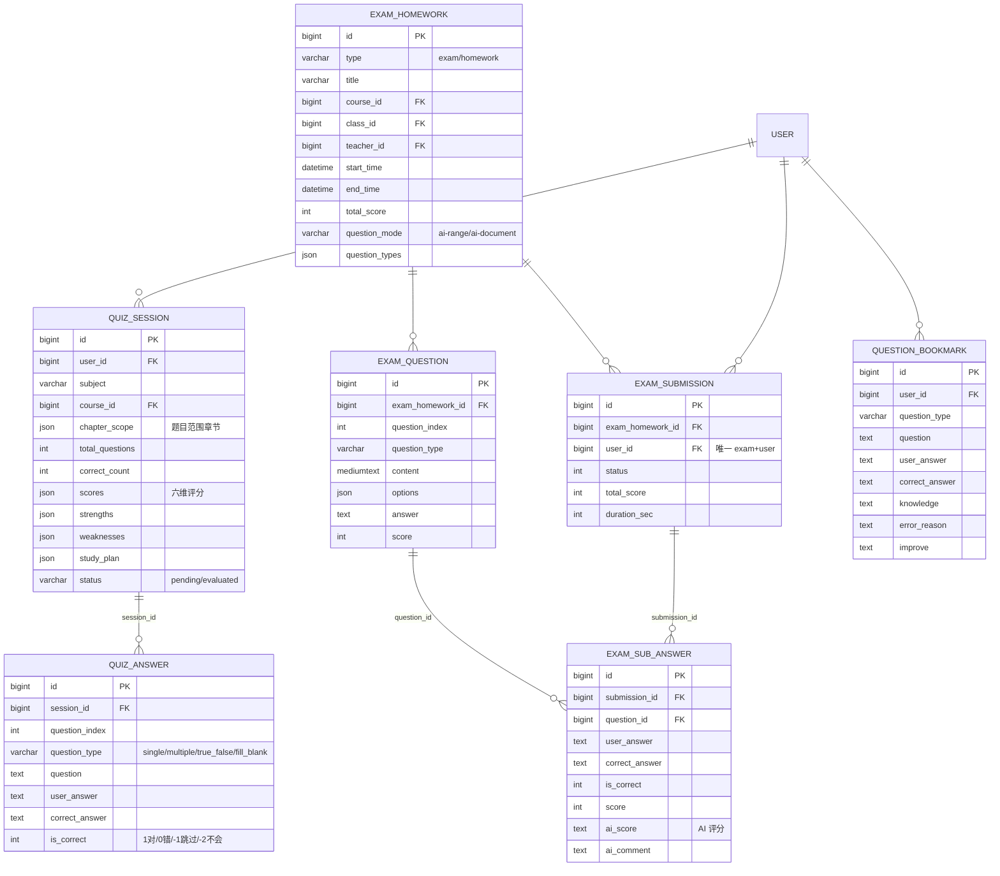

# RAG 智能学习 App

一个面向高校学生的 **"智能学习 + AI 答疑 + 自适应测验"** 一体化平台。学生在微信小程序与 Android App 上学习课程、向 AI 提问、参与随机测验与考试;教师在 React 管理后台维护课程、排课、布置作业、查看学情统计;管理员负责账号、学期、权限与全局配置。

项目覆盖"学(课程)→ 问(AI 答疑)→ 练(测验)→ 考(作业)→ 管(后台)"完整闭环,AI 能力基于 **RAG(检索增强生成)**:先把课程内容向量化入库,回答问题时先从知识库检索相关内容,再交给大模型生成,避免"凭空瞎编"。

> 面向人群:本项目开发者、毕业设计答辩评审、以及想二次开发的研究者。全文尽量用平实语言,技术概念在首次出现处给出简要解释。

---

## 目录

- [功能总览](#功能总览)
- [技术栈](#技术栈)
- [系统架构](#系统架构)
- [RAG 智能答疑工作逻辑](#rag-智能答疑工作逻辑)
- [数据库设计(ER 图)](#数据库设计er-图)
  - [用户与权限(RBAC)](#1-用户与权限)
  - [课程与排课](#2-课程与排课)
  - [智能学习与知识库](#3-智能学习与知识库)
  - [测验与考试](#4-测验与考试)
- [项目结构](#项目结构)
- [环境准备与启动](#环境准备与启动)
- [Docker 部署](#docker-部署)
- [配置说明](#配置说明)
- [开发约定与 Git 工作流](#开发约定与-git-工作流)
- [常见问题](#常见问题)

---

## 功能总览

| 模块 | 面向角色 | 主要能力 |
|---|---|---|
| 登录与权限(RBAC) | 管理员 / 教师 / 学生 | 账号密码登录,签发 JWT,管理员、教师、学生三角色按权限渲染菜单与接口 |
| 数据总览(Dashboard) | 管理员 / 教师 | 各类学习与业务指标的汇总看板 |
| 课程管理 | 管理员 / 教师 | 课程 → 章节 → 课时三级结构,支持 Word/PPT 批量导入章节,支持 AI 一键生成课程 |
| **智能答疑(AI 问答)** | 学生 | 课程群聊 + @AI 提问,RAG 检索课程内容后由大模型回答 |
| 排课 / 课表 | 管理员 | 教学任务导入、自动排课、冲突检测、教师调课与锁定 |
| **随机测验 / 复习** | 学生 | 按学生完成章节自适应出题、六维能力评估、错题本、复习计划 |
| 考试 / 作业 | 教师 / 学生 | AI 出题、自动判分、成绩查看 |
| 专注训练 | 学生 | 专注计时打卡与统计 |
| 考勤签到 | 管理员 | 课程签到 |
| 学习统计(Stats) | 教师 / 管理员 | 学情统计、六维能力分析图表 |

---

## 技术栈

| 端 | 技术 |
|---|---|
| **backend**(后端 API) | Spring Boot 3.2.0 · Java 17 · MyBatis-Plus 3.5.5 · Spring Security · JWT(jjwt 0.12.3) · WebSocket · Apache POI · MapStruct · Hutool · OkHttp |
| **web-admin-react**(管理后台) | React 18 · TypeScript · Vite 5 · Tailwind CSS · shadcn/ui · Zustand · React Router · Recharts |
| **miniapp**(微信小程序) | uni-app + Vue 2 · Vite(构建微信小程序) |
| **android**(学生 App) | 原生 Java · Gradle(AGP 8.2.2,minSdk 26 / targetSdk 34)· Retrofit · OkHttp · WebSocket |
| **embedding-service**(向量服务) | Python FastAPI · uvicorn · sentence-transformers(BGE-M3 模型) |
| **数据库 / 部署** | MySQL 8.0 · Nginx · Docker Compose · DeepSeek API(BGE-M3 本地向量化) |

一句话概括:**后端统一 Java 生态,前端分化出"React 管理端 + 微信小程序 + 原生 Android"三端,AI 侧用 DeepSeek 做生成、本地 BGE-M3 做向量化。**

---

## 系统架构



**架构要点**

- **单体后端 + 三端前端**:所有业务集中在 `backend` 一个 Spring Boot 服务,前端通过 HTTP/JSON 与 WebSocket 访问。
- **向量不存向量库**:系统没有引入 Milvus、pgvector 等专用向量数据库,而是把每个文本块的向量以 **JSON 数组存进 MySQL** 的 `document_vector` 表,检索时全量加载后在 Java 内存里算余弦相似度。这样省去多一个中间件,便于学生项目部署。
- **本地向量化 + 云端生成**:Embedding 用本机 BGE-M3 服务(离线、免费),对话生成用 DeepSeek API(在线、付费按量),二者职责分离。

---

## RAG 智能答疑工作逻辑

这是本项目 AI 能力的核心。它解决一个常见问题:**直接问大模型课程问题,大模型会用"自学"的知识回答,可能与你的教材对不上**。RAG 的做法是——回答前先检索本次课程的真实内容,把相关内容作为"参考材料"塞进提示词,让回答有据可依。

### 知识入库:课程内容如何变成向量知识库



课程的三种内容来源(`课时正文`、`AI 生成的章节`、`手动上传的文档`)都会先被**切成文本块**(上传文档按 500 字切块),然后调用本地 `embedding-service` 把每块文本转成 **1024 维向量**,连同课程名、章节、原文一起写入 `document_vector` 表。

### 问答推理:一次 AI 提问的完整链路



**关键设计点**

- **优雅降级**:如果 Embedding 服务挂了、或某个课程没有向量数据,`retrieveContext` 不会报错,而是返回空参考材料,直接凭大模型能力回答——保证 AI 一直在线不崩。
- **检索兜底**:无向量时会退化为"查最近 20 条聊天做关键词匹配"再取前 3 条,尽量给到课程相关的上下文。
- **限流保护**:全局 2 次/秒,每用户 10 次/分钟,防刷也防止深度付费 API 被打爆。
- **双入口**:主入口 `POST /api/chat/rag` 专门做答疑;课程群聊里只要消息带 `@AI` 也会走同样的 RAG + 生成流程。

---

## 数据库设计(ER 图)

系统共约 **47 张表**。为防止一张图堆满看不清楚,下面按 **四个业务域** 拆开呈现;未画出的次要表(如通知、学习目标、专注记录等)在文末列出。`crows foot` 标注中 `||` 表示必选一端、`o|` 可选一端、`}|` 表示多端。

### 1. 用户与权限



用户体系分两层:**简化的业务角色**(`user.role`:1 学生 / 2 教师 / 3 管理员,后端据此做粗粒度控制) + **完整 RBAC 表**(`sys_role`/`sys_permission`/`sys_user_role`/`sys_role_permission`/`sys_data_permission`,支持更细的菜单、按钮、API、数据行级权限)。`teacher` 与 `user` 是两张独立表,教师身份靠 `user.role=2` 标记,二者是业务上的弱关联。

### 2. 课程与排课



排课链路为:**管理员录入 `teaching_task`(学期×班级×课程×教师) → 自动排课引擎生成大量 `schedule`(星期×节次×教室×周次) → 教师可调课后用 `schedule_lock` 锁定,防止被重排覆盖**。注意两点:教室通过**名称字符串**与 `schedule` 匹配(非外键);`course.semester` 是字符串,不与 `semester` 表强外键。

### 3. 智能学习与知识库



本系统**没有独立的"知识点表"**——`document_vector` 就是知识存储,`course_chapter`/`course_lesson` 是三层课程结构。学生阅读进度记在 `chapter_read_progress`,用于限定 AI 出题范围;`user_course_difficulty` 记录每个学生每门课的难度档,实现个性化。

### 4. 测验与考试



**自适应测验循环**:系统结合学生"已完成章节 + 难度档",让大模型**现场出题(15 题)** → 学生作答后自动判分 → 再让大模型给出**六维能力评估**和复习建议 → 根据连续 2 次同方向的正确率/用时**保守升降难度档**,实现个性化学习。

**其余次要表**:`learning_goal`(学习目标)、`learning_plan`(学习计划)、`notification`/`notification_receipt`(通知)、`checkin_task`/`checkin_record`(GPS/二维码签到)、`check_in`/`check_in_record`(密码签到)、`student_status`(在线状态)、`user_profile`(AI 画像)、`wrong_analysis_cache`(错题分析缓存)、`course_import_record`(排课导入记录)、`schedule_rule`(排课规则)。

---

## 项目结构

```
aiStudy/
├── backend/                  # Spring Boot 后端(统一 API)
├── web-admin-react/          # React 管理后台(管理员 + 教师)
├── miniapp/                  # uni-app 微信小程序(学生)
├── android/                  # 原生 Android App(学生)
├── embedding-service/        # Python FastAPI 本地向量服务(BGE-M3)
├── nginx/                    # 反向代理 + 静态资源托管
├── init-db/znxsgltest.sql    # 数据库初始化脚本(建表 + 种子数据)
├── docs/                     # 架构、工作流、导入规范、测试文档
├── scripts/                  # 数据库诊断、RBAC 验证等运维脚本
├── test/                     # 自动化/负载测试与测试数据(不纳入 Git)
├── docker-compose.yml        # 一键编排 MySQL + backend + Nginx
├── Dockerfile                # 后端多阶段构建镜像
└── .gitignore                # 忽略模型/产物/日志/uploads 等
```

---

## 环境准备与启动

### 本地开发需求

| 组件 | 版本建议 | 说明 |
|---|---|---|
| JDK | 17+ | 后端运行环境 |
| Maven | 3.9+ | 后端构建 |
| MySQL | 8.0 | 数据库 |
| Node.js | 18+ | 前端构建 |
| Python | 3.10+ | 本地向量服务 |
| Docker + Docker Compose | 最新 | 一键部署(可选) |

### 后端启动

```bash
# 1. 准备数据库
#    先启动 MySQL,然后用 init-db/znxsgltest.sql 建库建表:
#    mysql -u root -p < init-db/znxsgltest.sql

# 2. 设置环境变量(必填,否则 AI 功能不可用)
export DEEPSEEK_API_KEY="你的DeepSeek密钥"
export DB_HOST="localhost"    # 或 127.0.0.1

# 3. 启动后端(会自动拉起本地 embedding-service)
cd backend
mvn spring-boot:run
```

### 前端启动

```bash
# React 管理后台(管理员/教师使用)
cd web-admin-react
npm install
npm run dev          # 默认 http://localhost:5174

# 微信小程序
cd miniapp
npm install
# 用微信开发者工具打开该目录即可
```

### Android App

用 Android Studio 打开 `android/` 目录,同步 Gradle 后运行到模拟器或真机。需要保证手机与后端在同一网络,并在配置中把 API 地址指向后端。

### 本地向量服务(可手动单独启动)

后端默认 `embedding.local.auto-start: true`,会在 Spring 启动时**自动拉起**该服务。若想手动启动:

```bash
cd embedding-service
pip install -r requirements.txt          # 需可下载/FastAPI/uvicorn/sentence-transformers
python start.bat                          # 或用: uvicorn main:app --port 8000
curl http://localhost:8000/health         # 返回 ok 表示就绪
```

---

## Docker 部署

项目提供 `docker-compose.yml`,编排 **3 个容器**:

| 服务 | 端口 | 说明 |
|---|---|---|
| `mysql` | 宿主 3307 → 3306 | 数据库,自动挂载 `init-db` 初始化 |
| `backend` | 8080 | 后端 API,自动拉起向量服务 |
| `nginx` | 80 | 静态托管 + `/api` `/ws` `/uploads` 反代到后端 |

部署步骤:

```bash
# 1. 设置后端所需环境变量
export DEEPSEEK_API_KEY="你的DeepSeek密钥"

# 2. 一键构建启动
docker compose up -d --build

# 3. 访问
#  http://<服务器IP>    管理后台
#  Nginx 将 /api /ws /uploads 转发到 backend
```

> 注意:`docker-compose.yml` 中 Nginx 静态目录当前指向 `./web-admin`,而现役管理端是 `web-admin-react`。如需用 Docker 托管前端,请把 Nginx 配置的上传目录改为对应构建产物,详见 `nginx/default.conf`。此点与当前仓库结构尚未完全对齐。

---

## 配置说明

| 配置项 | 位置 | 说明 | 必填 |
|---|---|---|---|
| `DEEPSEEK_API_KEY` | 环境变量 | DeepSeek 密钥,**不写入代码/配置文件** | 是(AI 功能) |
| `JWT_SECRET` | 环境变量(有默认) | JWT 签名密钥,生产建议自定义 | 否 |
| `DB_USERNAME` / `DB_PASSWORD` | 环境变量(有默认) | 数据库账号密码,默认 root/123456 | 否 |
| `llm.model` / `llm.url` | `application.yml` | 默认 `deepseek-v4-pro` + DeepSeek 官方地址 | 否 |
| `embedding.local.url` | `application.yml` | 默认 `http://localhost:8000/embeddings` | 否 |
| `embedding.local.auto-start` | `application.yml` | 是否随后端自动拉起向量服务,默认 true | 否 |

**安全约定**:密钥一律通过环境变量注入,严禁硬编码在 `application.yml`、配置文件或代码里。若此前有密钥进入过 Git 历史,请先在 DeepSeek 平台重置该密钥,并确认推送前清除历史。

---

## 开发约定与 Git 工作流

这是单人毕业设计项目,但仍建议遵守一套简单可靠的 Git 规范,把"改坏"的风险降到最低:

1. **`main`(主干)只放稳定版本**:保持能跑、能部署。
2. **新功能先开分支**:每次想改功能,先建分支再动手,主干不受影响。
   ```bash
   git checkout -b feature/xxx       # 开新分支
   git add -A && git commit -m "feat: ..."   # 小步提交
   git push -u origin feature/xxx    # 备份到云端
   git checkout main && git merge feature/xxx   # 验证无误后合回主干
   ```
3. **提交信息规范**:`feat:` 新功能 / `fix:` 修 bug / `chore:` 杂项 / `docs:` 文档 / `refactor:` 重构。
4. **每次都检查再推**:推送前用 `git status` 看有没有意外文件;密钥类内容绝不进仓库(参考上方安全约定)。
5. **`.gitignore` 保护**:AI 模型、`node_modules`、编译产物、日志、`uploads` 上传目录均已被忽略,不要强行 `git add -f` 提交它们。

---

## 常见问题

**Q1:AI 回答为空或提示服务不可用?**
先确认 `DEEPSEEK_API_KEY` 环境变量已设置且有效,再确认网络可访问 DeepSeek;也可看后端日志中是否有限流(`RateLimitException`)或超时报错。

**Q2:回答没有用到自己上传的课程资料(像在"瞎编")?**
RAG 依赖 `document_vector` 有对应课程数据。请先上传或生成该课程的文档/章节并确认向量化成功(有 embedding),再提问。若向量服务没起来,系统会自动降级为泛化回答。

**Q3:本地向量服务端口被占用/启动失败?**
可把 `embedding.local.auto-start` 临时设为 `false`,手动用 `python start.bat` 启动并观察报错;确认 `models/bge-m3` 模型目录存在(首次会自动下载)。

**Q4:推送到 GitHub 被拦截说检测到密钥?**
说明历史或当前文件仍含密钥。请先重置密钥、用工具把密钥从历史中清除并重写 Git 历史,再重新推送(详见上方安全约定)。

**Q5:表格/课程导入失败?**
先确认导入文件的表头字段与 `docs/schedule-import-spec.md`、`docs/course-chapter-import-plan.md` 的规范一致;导入采用"AI 提取 + 人工预览确认"两步,预览时可检查解析是否正确。

---

本文档随项目演进同步更新。关于更细的接口清单、数据库 DDL、架构细节,请查阅 [`docs/architecture.md`](docs/architecture.md) 与 [`RAG智能学习App开发方案.md`](RAG智能学习App开发方案.md)。