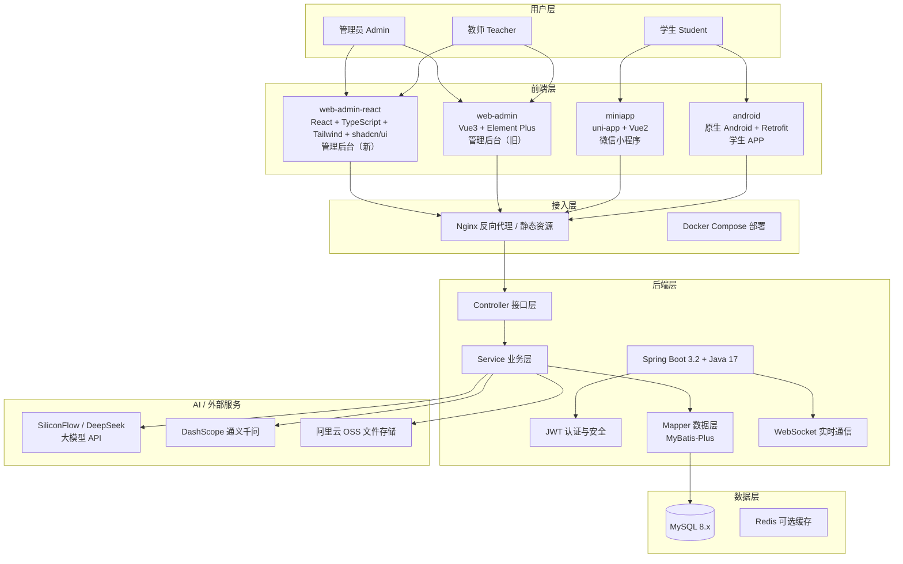
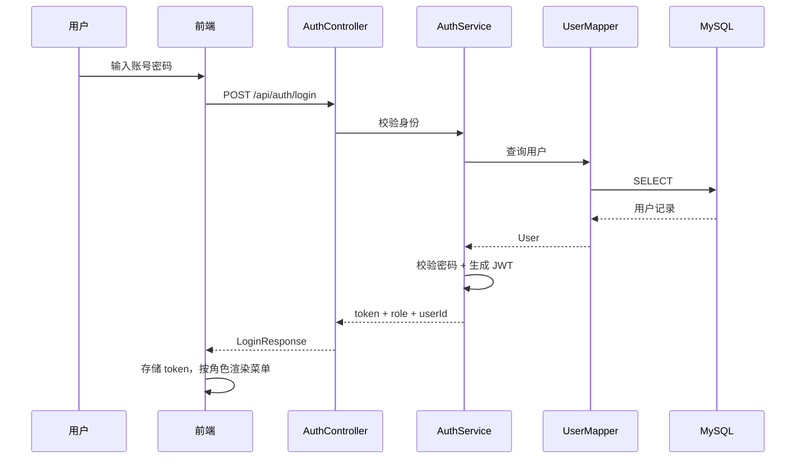
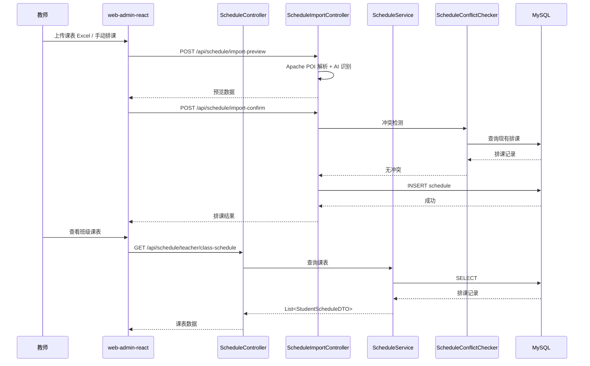
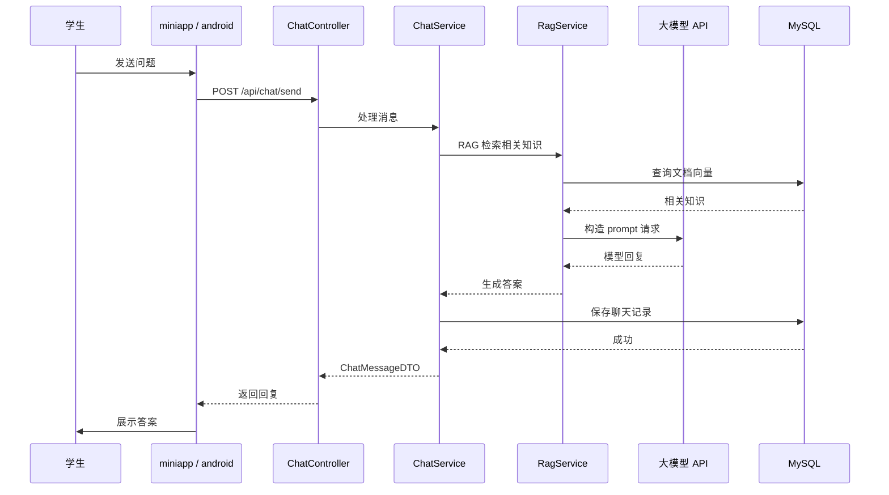
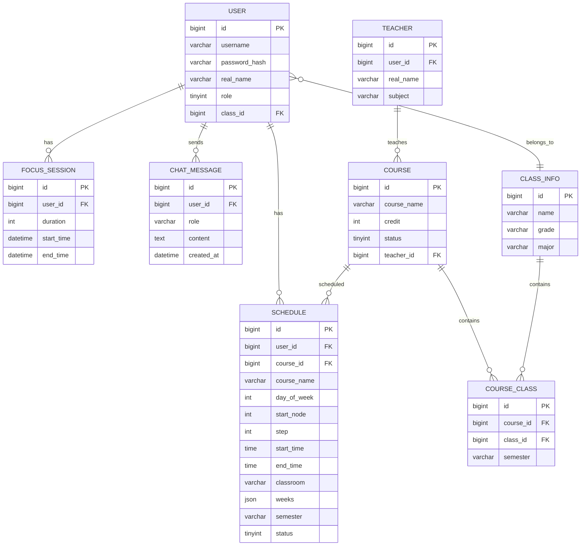
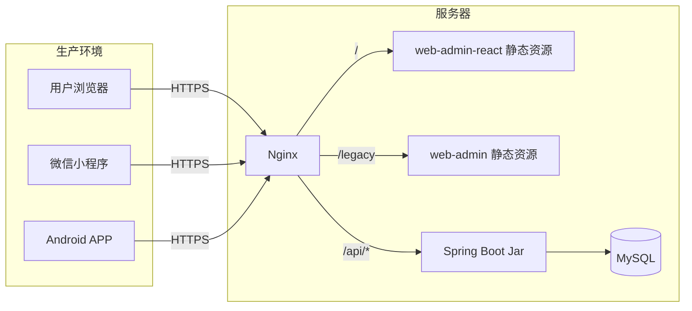

# aiStudy 智能学习管理系统架构图

## 1. 项目概述

aiStudy 是一套面向职业学校的智能学习管理系统，覆盖管理员、教师、学生三种角色，提供课程管理、课表排课、学习统计、AI 答疑、专注训练、考勤签到等核心能力。

## 2. 系统架构

## 3. 模块说明

| 模块 | 技术栈 | 职责 |
|------|--------|------|
| `web-admin-react` | React 18 + TypeScript + Vite 5 + Tailwind CSS + shadcn/ui + Zustand | 新版管理后台，面向管理员和教师，参考千问 AI 平台风格 |
| `web-admin` | Vue 3 + Element Plus + Vite | 旧版管理后台，逐步迁移至 React 版本 |
| `miniapp` | uni-app + Vue 2 + Vite | 学生微信小程序，提供课表、学习、聊天、个人中心 |
| `android` | 原生 Android + Retrofit + WebSocket | 学生 Android APP，功能同小程序 |
| `backend` | Spring Boot 3.2 + MyBatis-Plus + JWT + WebSocket | 统一业务接口与数据处理 |
| `init-db` | SQL 脚本 + Python 生成工具 | 数据库初始化、测试数据、迁移脚本 |
| `nginx` | Nginx | 反向代理、负载均衡、静态资源托管 |

## 4. 后端分层架构

```mermaid
flowchart TB
    subgraph Controller 接口层
        C1[AuthController]
        C2[AdminUserController]
        C3[ScheduleController]
        C4[ScheduleImportController]
        C5[TeacherClassController]
        C6[TeacherScheduleAdjustController]
        C7[ChatController]
        C8[FocusController]
        C9[QuizController]
        C10[SemesterController]
    end

    subgraph Service 业务层
        S1[AuthService]
        S2[ScheduleService]
        S3[AutoScheduleService]
        S4[ScheduleConflictChecker]
        S5[ChatService]
        S6[RagService]
        S7[DashScopeService]
    end

    subgraph Mapper 数据层
        M1[UserMapper]
        M2[ScheduleMapper]
        M3[CourseMapper]
        M4[ClassInfoMapper]
        M5[TeacherMapper]
        M6[ChatMessageMapper]
        M7[FocusSessionMapper]
    end

    subgraph 实体与 DTO
        E1[Entity 数据库实体]
        E2[DTO 数据传输对象]
    end

    C1 --> S1
    C2 --> S1
    C3 --> S2
    C4 --> S2
    C5 --> S2
    C6 --> S2
    C7 --> S5
    C8 --> S5
    C9 --> S5
    C10 --> S2

    S2 --> S3
    S2 --> S4
    S3 --> S4
    S5 --> S6
    S6 --> S7

    S1 --> M1
    S2 --> M2
    S2 --> M3
    S2 --> M4
    S2 --> M5
    S5 --> M6
    S5 --> M7

    M1 --> E1
    M2 --> E1
    M3 --> E1
    M6 --> E1

    C1 --> E2
    C2 --> E2
    C3 --> E2
```

## 5. 核心数据流

### 5.1 登录流程

### 5.2 排课流程

### 5.3 AI 答疑流程

## 6. 数据库核心表

## 7. 部署拓扑

## 8. 技术栈汇总

| 层级 | 选型 |
|------|------|
| 前端（新管理端） | React 18 + TypeScript + Vite 5 + Tailwind CSS + shadcn/ui + Zustand + React Router + Recharts |
| 前端（旧管理端） | Vue 3 + Element Plus + Vite |
| 前端（小程序） | uni-app + Vue 2 + Vite |
| 前端（Android） | 原生 Android + Retrofit + WebSocket |
| 后端 | Spring Boot 3.2 + Java 17 + MyBatis-Plus + Spring Security + JWT + WebSocket |
| 数据库 | MySQL 8.x |
| AI 接口 | SiliconFlow / DeepSeek / DashScope |
| 文件存储 | 阿里云 OSS（推荐） / 本地磁盘 |
| 部署 | Docker + Docker Compose + Nginx |

## 9. 演进方向

1. **管理端迁移**：逐步将 `web-admin` 的功能迁移到 `web-admin-react`，最终下线旧版。
2. **组件库统一**：将 `web-admin-react` 的 UI 组件沉淀为项目级设计系统。
3. **服务拆分**：随着业务增长，可将 AI 服务、文件服务、通知服务拆分为独立微服务。
4. **数据可视化**：引入更丰富的学习分析图表，支持班级对比、趋势预测。
